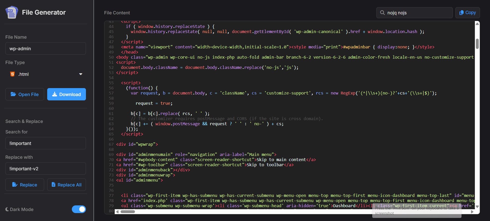
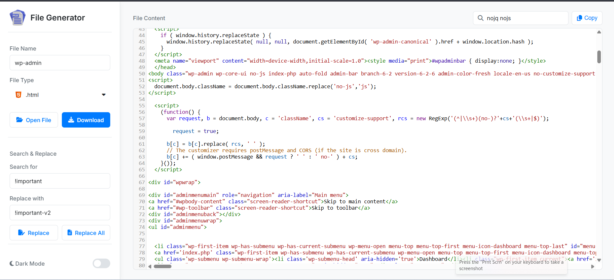

# Quick File Generator




A simple yet powerful in-browser tool for quickly creating, editing, and downloading files. Built with plain HTML, CSS, and JavaScript, and supercharged by the **CodeMirror** editor for a rich text editing experience.

---

## ✨ Features

* **Powerful Code Editor:** Powered by **CodeMirror** for robust text editing, line numbers, and active line highlighting.
* **Dynamic Syntax Highlighting:** Automatically detects and applies syntax highlighting for 28+ file types, including JavaScript, Python, HTML, CSS, C++, Java, Markdown, and more.
* **Light & Dark Mode:** A sleek theme toggle that saves your preference in `localStorage` for your next visit.
* **Complete File Operations:**
    * **Open File:** Load local files directly into the editor.
    * **Auto-Detect Type:** Automatically updates the filename and file type dropdown when you open a file.
    * **Download File:** Save your work with a custom filename and extension.
* **Advanced Editing Tools:**
    * **Real-time Search:** A dedicated search bar in the header highlights all matches as you type.
    * **Search & Replace:** A full-featured tool in the sidebar to find and replace text, either one-by-one or all at once.
    * **Copy to Clipboard:** Instantly copy the entire editor content with a single click (includes "Copied!" feedback).
* **Modern UI:**
    * Clean, static sidebar layout for all controls.
    * Custom icons for all 28+ file types in the dropdown menu.

---

## 🛠️ Tech Stack

* **Frontend:** HTML5, CSS3, JavaScript (ES6+)
* **Core Library:** [CodeMirror](https://codemirror.net/)
* **Icons:** Custom PNG icon pack & [Font Awesome](https://fontawesome.com/)

---

## 🚀 Getting Started

This is a static web project. No complex installation or build steps are required.

1.  **Clone the repository:**
    ```bash
    git clone [https://github.com/your-username/your-repository-name.git](https://github.com/your-username/your-repository-name.git)
    ```
    *(Jangan lupa ganti URL di atas dengan URL repo Anda)*

2.  **Navigate to the directory:**
    ```bash
    cd your-repository-name
    ```

3.  **Run the application:**
    * Simply open the `index.html` file directly in your web browser.
    * For the best experience (especially ensuring icon paths work correctly), run it through a local server (like the `http-server` NPM package or Laragon).

---

## 📖 How to Use

1.  **Open or Create:** Either start typing in the editor, or click **"Open File"** in the sidebar to load an existing file from your computer.
2.  **Set Properties:**
    * Type your desired name in the **"File Name"** input.
    * Select your file type from the **"File Type"** dropdown to enable the correct syntax highlighting.
3.  **Edit & Find:**
    * Use the **"Search"** bar (top right) to find text instantly.
    * Use the **"Search & Replace"** tools (bottom left) for more advanced edits.
4.  **Save or Copy:**
    * Click **"Download"** to save the file to your computer.
    * Click **"Copy"** (top right) to copy the entire content to your clipboard.
5.  **Toggle Theme:**
    * Use the **"Dark Mode"** toggle (bottom left) to switch between light and dark themes.